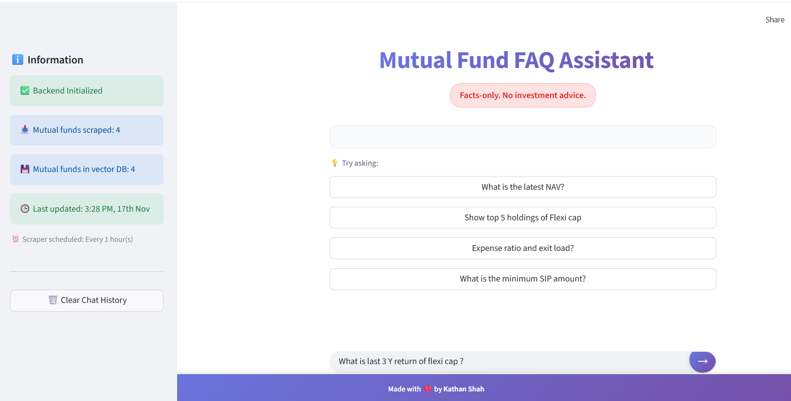

# 📘 Mutual Fund FAQ Assistant — README



A RAG based chatbot that provides **facts-only** mutual fund information using a **RAG pipeline** (Google Gemini + ChromaDB) with scraping-based data refresh.

---

## 📌 Scope of This Project

### **1. Coverage**

* **AMCs supported:** All asset management companies for which data is available in your scraper configuration (default config contain Groww MF pages).

* **defualt-Schemes supported:**

  * AMC : Nippon 
  * Equity : Large, Mid, Small, Flexi, ELSS

### **2. What the assistant can answer**

* NAV
* AUM
* Expense ratio
* Fund category
* Lock-in period
* Minimum SIP/Lumpsum
* Exit load
* Scheme details
* Top holdings 

### **3. What the assistant will **NOT** do**

* No investment advice
* No buy/sell/hold suggestions
* No predictions or opinions
* No acceptance of PII (PAN, Aadhaar, phone, email, OTP, account number)

---

## ⚠ Known Limitations

* **Data accuracy is limited to what is scraped**
  If Groww or any source changes structure, fields may be missing.

* **RAG relies on scraped JSON only**
  If a scheme is not scraped, the assistant cannot answer.

* **Fund performance advice are intentionally blocked.**

* **Scraper may temporarily fail** if rate-limited or if DOM changes.

* **Vector DB only stores what ingestion pipeline processes**
  (If database is empty, first-time ingestion is required.)

* **Comparisons allowed only for factual parameters**
  (e.g., AUM, Expense Ratio).
  Performance-based comparisons are blocked by policy.

---

# 🛠 Setup Steps

## 1. Clone the repository

```bash
git clone <your-repo-url>
cd MF-Chatbot
```

## 2. Create virtual environment

```bash
python -m venv venv
source venv/bin/activate    # macOS/Linux
venv\Scripts\activate       # Windows
```

## 3. Install dependencies

```bash
pip install -r requirements.txt
```

**Note:** The project uses two dependency files:
- `requirements.txt` - Python packages (installed via pip)
- `packages.txt` - System packages (installed via apt-get on Streamlit Cloud)

## 4. Install Playwright (optional but recommended)

```bash
playwright install chromium
```

## 5. Add API Key

### Option A — Streamlit Secrets (**recommended**)

Create `.streamlit/secrets.toml`:

```toml
GEMINI_API_KEY = "your-key"
```

### Option B — Environment variables

Create `.env`:

```env
GEMINI_API_KEY=your-key
```

## 6. Configure Scraper

Edit `scraper_config.json` to define:

* AMC fund URLs
* Scraping interval (hourly/daily)
* Auto-ingestion toggle

Example configuration:

```json
{
  "scraper_settings": {
    "output_dir": "./data/mutual_funds",
    "use_interactive": true
  },
  "urls": [
    {
      "url": "https://groww.in/mutual-funds/..."
    }
  ],
  "schedule": {
    "enabled": true,
    "interval_type": "hourly",
    "interval_hours": 1,
    "auto_ingest_after_scrape": true
  }
}
```

## 7. Run ingestion (only once initially)

```bash
python scripts/ingest_data.py
```

This will:
- Load JSON files from `data/mutual_funds/`
- Chunk documents semantically
- Generate embeddings using Gemini
- Store in ChromaDB vector database

## 8. Start the app

```bash
streamlit run app.py
```

The app will automatically:
- Initialize vector store and RAG chain
- Check for new URLs if scraper is enabled
- Run initial scraping/ingestion if data is stale or missing
- Start scheduled scraper service if enabled

Access the app at `http://localhost:8501`

---

# 📂 Project Structure (Simplified)

```
MF-Chatbot/
├── app.py                          # Main Streamlit application
├── config.py                       # Configuration management
├── scraper_config.json             # Scraper configuration
├── requirements.txt                # Python dependencies (pip)
├── packages.txt                    # System dependencies (apt-get)
├── data/
│   ├── mutual_funds/              # Scraped JSON files
│   └── downloaded_html/            # Cached HTML (optional)
├── ingestion/
│   ├── document_loader.py          # JSON file loader
│   └── chunker.py                  # Semantic chunking
├── retrieval/
│   └── rag_chain.py                # RAG chain with Gemini
├── scrapers/
│   └── groww_scraper.py            # Web scraper
├── vector_store/
│   └── chroma_store.py             # ChromaDB integration
├── scripts/
│   ├── ingest_data.py              # Manual ingestion script
│   └── scheduled_scraper.py       # Scheduled scraper service
└── chroma_db/                      # Vector database storage
```

---

# 📝 Sample Q&A (5–10 Examples)

### **Q1: What is the NAV of Nippon India Large Cap Fund?**

**A:** The NAV of Nippon India Large Cap Fund Direct Growth is ₹**104.68** as of 12 Nov 2025.

**Source:** [Groww Mutual Fund Page](https://groww.in/mutual-funds/nippon-india-large-cap-fund-direct-growth)

---

### **Q2: What is the expense ratio of Nippon India Flexi Cap Fund?**

**A:** The expense ratio is **X.XX%** (exact value from scraped data).

**Source:** Scraped data → Groww scheme page.

---

### **Q3: What is the lock-in period of ELSS funds?**

**A:** ELSS funds have a **mandatory 3-year lock-in period** as per SEBI regulations. This means you cannot redeem your investment before completing 3 years from the date of investment.

**Source:** Documented factual rule via scraped MF data.

---

### **Q4: What is the AUM of Nippon India Growth Mid Cap Fund?**

**A:** The AUM (Assets Under Management) is ₹**XXXX Cr** as per the last scrape timestamp.

**Source:** [Groww Scheme Page](https://groww.in/mutual-funds/nippon-india-growth-mid-cap-fund-direct-growth)

---

### **Q5: Compare expense ratios of Large Cap vs Flexi Cap funds**

**A:** Here are factual expense ratios for the funds in your dataset:

| Fund Name | Category | Expense Ratio |
|-----------|----------|---------------|
| Nippon India Large Cap Fund | Large Cap | X.XX% |
| Nippon India Flexi Cap Fund | Flexi Cap | Y.YY% |

(No advice or qualitative judgment.)

**Source:** Ingested JSON documents from scraped data.

---

### **Q6: Show minimum SIP amount for Nippon India ELSS Tax Saver Fund**

**A:** The minimum SIP amount is ₹**500** per month.

**Source:** Fund metadata → scraped JSON.

---

### **Q7: What is the exit load for ELSS funds?**

**A:** **No exit load** applies because ELSS funds already have a mandatory 3-year lock-in period, which prevents early redemption.

**Source:** Extracted fund facts from scraped data.

---

### **Q8: How many schemes are currently scraped?**

**A:** Total schemes scraped: **4** (as shown in the sidebar status).

**Source:** Vector DB metadata and scraper status.

---

### **Q9: Give top 5 holdings of Nippon India Flexi Cap Fund**

**A:** Top 5 holdings (if available in scraped data):

1. Reliance Industries Ltd.
2. HDFC Bank Ltd.
3. Infosys Ltd.
4. ICICI Bank Ltd.
5. TCS Ltd.

*(Holdings data depends on availability in your scraper dataset)*

**Source:** Scheme holdings section from scraped JSON.

---

### **Q10: What is the category of Nippon India ELSS Tax Saver Fund?**

**A:** Category: **ELSS (Equity Linked Savings Scheme)** - Equity Oriented

**Source:** Scraped scheme facts from Groww mutual fund page.

---

# 🔧 Troubleshooting

### "GEMINI_API_KEY not found" Error

- Make sure you've created `.streamlit/secrets.toml` or `.env` file
- Verify the API key is correct
- For Streamlit Cloud, add it via the Secrets dashboard

### "Backend not initialized" Error

- Check that your API key is valid
- Ensure all dependencies are installed: `pip install -r requirements.txt`
- Check the terminal for detailed error messages

### Scraper Not Running

- Check `scraper_config.json` - ensure `schedule.enabled` is `true`
- Verify Playwright browsers are installed: `playwright install chromium`
- Check the sidebar for scraper status
- Review logs in the terminal for errors

### No Documents in Database

- Run the ingestion script: `python scripts/ingest_data.py`
- Ensure JSON files exist in `./data/mutual_funds/`
- Check that the scraper has run and created data files
- Verify the scraper status in the sidebar

---

# 📚 Additional Documentation

- [ARCHITECTURE.md](ARCHITECTURE.md) - Detailed architecture documentation
- [sources.md]- soruces that are used in this RAG based chatbot 
---

# 👤 Author

Made with ❤️ by **Kathan Shah** as part of Nextleap Gen AI Cohort C1

---

# 🤝 Support

For issues or questions, please open an issue on GitHub.
